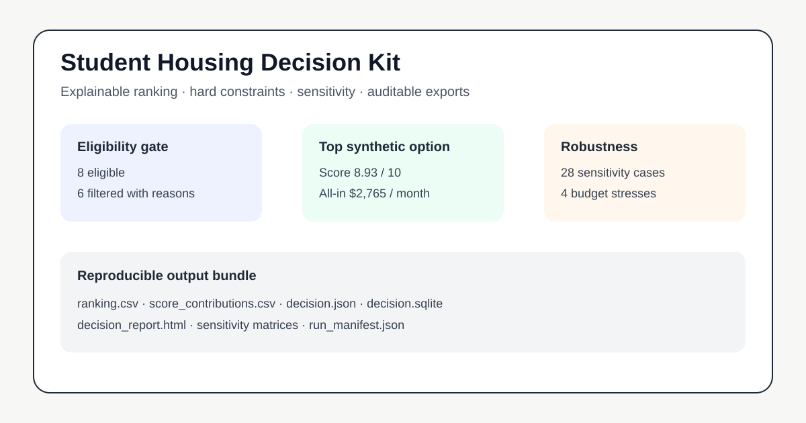
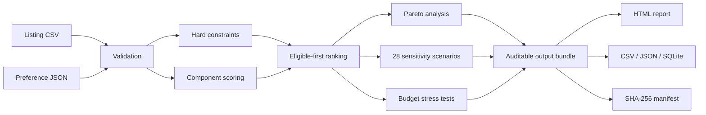

# Student Housing Decision Kit

**Explainable, privacy-conscious decision support for comparing student housing options.**

The kit turns a listing CSV and a preference JSON file into an auditable decision bundle: ranked options, explicit exclusion reasons, all-in cost, signing cash, first-year cost, component-level score contributions, Pareto trade-offs, sensitivity analysis, budget stress tests, a self-contained HTML report and a queryable SQLite database.

> **Public-data boundary:** every committed example row is fictional and marked `is_synthetic=true`. This repository contains no real applicant, landlord, property, contact, lease or active-listing record.

## Why this exists

Housing searches often fail for predictable reasons:

- rent is compared without mandatory fees, utilities or signing cash;
- stale availability is mixed with current evidence;
- a weighted score silently overrides non-negotiable constraints;
- rejected options disappear, making the decision impossible to audit;
- a single ranking is treated as stable even when reasonable weights change;
- personal search data is copied into public notebooks or repositories.

This project treats those as engineering requirements rather than presentation details.

## What the engine produces

| Output | Purpose |
|---|---|
| `ranking.csv` | Full ranking, eligibility, costs, source age and every component score |
| `score_contributions.csv` | Long-form decomposition of each weighted contribution |
| `sensitivity_summary.csv` | Best/worst/average rank and robustness across scenarios |
| `sensitivity_matrix.csv` | Every listing under every sensitivity scenario |
| `budget_scenarios.csv` | Base and cost/FX stress cases |
| `validation.json` | Structured input warnings and errors |
| `decision.json` | Complete machine-readable decision payload |
| `decision_report.html` | Self-contained visual report |
| `decision.sqlite` | Relational export for downstream SQL analysis |
| `run_manifest.json` | Input identity, run metadata and SHA-256 hashes |

## Deterministic demonstration

The committed example uses 14 fictional listings and a fixed analysis date. The current v0.1.0 result is:

- **14** options evaluated;
- **8** pass all hard constraints;
- **28** sensitivity scenarios;
- **4** budget stress scenarios;
- top eligible option: **Scholars Landing**;
- score: **8.9267 / 10**;
- all-in monthly cost: **$2,765**;
- signing cash: **$7,900**.

These numbers demonstrate the model only; they are not real market information.

Portable reproducibility is verified byte-for-byte for CSV, JSON and HTML artifacts. SQLite is compared by schema and ordered row content because its physical file layout can vary across SQLite runtime versions; the manifest is normalized only for that SQLite file digest.

[Open the committed HTML demonstration](examples/synthetic_city/output/decision_report.html)



## Quick start

Requires Python 3.11 or newer. The runtime has no third-party dependencies.

```bash
git clone https://github.com/JINGJAYHUANG/student-housing-decision-kit.git
cd student-housing-decision-kit
python -m pip install -e .
```

Validate inputs:

```bash
housing-decision validate \
  --listings examples/synthetic_city/listings.csv \
  --preferences examples/synthetic_city/preferences.json \
  --as-of 2026-06-15
```

Generate the deterministic example:

```bash
housing-decision evaluate \
  --listings examples/synthetic_city/listings.csv \
  --preferences examples/synthetic_city/preferences.json \
  --as-of 2026-06-15 \
  --generated-at 2026-06-15T12:00:00Z \
  --output-dir examples/synthetic_city/output
```

Run the complete verification suite:

```bash
make all
```

## Decision model

### 1. Validate the evidence

The input layer checks, among other things:

- duplicate listing IDs;
- required fields and numeric bounds;
- future `source_checked_at` dates;
- invalid housing modes;
- impossible layouts or costs;
- missing source identifiers;
- whether every row is explicitly synthetic before publication.

Validation errors stop evaluation. Warnings remain visible.

### 2. Apply hard constraints separately

A listing can be filtered because of:

- disallowed housing mode;
- safety below the configured floor;
- commute beyond the configured cap;
- move-in later than the tolerated delay;
- signing cash above the cap;
- monthly all-in cost above an enforced budget cap;
- evidence older than the freshness threshold.

Filtered listings are retained in the output with all reasons. They are not silently discarded.

### 3. Compute an explainable 0–10 score

The default model supports eleven criteria:

```text
affordability  safety       commute       convenience
management     quiet        space         application
timing         freshness    completeness
```

Weights are normalized to 1.0. The total score is:

```text
total_score = Σ(component_score × normalized_weight)
```

Affordability, commute, timing, freshness and completeness use explicit scoring curves. The remaining qualitative inputs are user-supplied 0–10 assessments and should be supported by documented evidence.

### 4. Show trade-offs

An eligible option is marked **Pareto efficient** when no other eligible option is simultaneously:

- no more expensive on all-in monthly cost;
- no worse on commute;
- at least as highly scored;
- and strictly better on at least one of those dimensions.

### 5. Stress the conclusion

The engine runs 28 deterministic scenarios:

- baseline;
- each of 11 weights reduced by 25%;
- each of 11 weights increased by 25%;
- budget cap reduced by 10%;
- budget cap increased by 10%;
- commute cap tightened by 20%;
- safety floor increased by 1 point;
- move-in tolerance halved.

The robustness score summarizes rank stability and how often an option remains eligible. It is **not** a probability of success.

## Input contract

Listings are CSV rows. Preferences are JSON. See:

- [`docs/data_dictionary.md`](docs/data_dictionary.md)
- [`schemas/listing.schema.json`](schemas/listing.schema.json)
- [`schemas/preferences.schema.json`](schemas/preferences.schema.json)

The analysis date is deliberately not inferred:

```text
--as-of YYYY-MM-DD
```

This prevents a stale dataset from being presented without a temporal reference.

## Architecture



The package is intentionally local-first and dependency-free. It does not scrape websites, call mapping APIs, send personal data or apply for housing.

## SQL examples

The SQLite export supports portfolio-style analysis without another data pipeline.

```sql
SELECT
    l.name,
    r.rank,
    r.total_score,
    r.all_in_monthly,
    s.best_rank,
    s.worst_rank,
    s.robustness_score
FROM rankings AS r
JOIN listings AS l USING (listing_id)
JOIN sensitivity_summary AS s USING (listing_id)
WHERE r.eligible = 1
ORDER BY r.rank;
```

More queries are in [`sql/example_queries.sql`](sql/example_queries.sql).

## Privacy and publication policy

Do not commit:

- names, phone numbers, email addresses or application identifiers;
- active property addresses or current availability snapshots without a clear license;
- lease documents, guarantor records, bank evidence or immigration records;
- user-specific weights or notes that reveal a private profile;
- credentials, cookies, API keys or local absolute paths.

The repository includes a conservative scanner:

```bash
python scripts/privacy_scan.py
```

It is a guardrail, not a guarantee. Human review is still required. See [`docs/privacy-and-publication-boundary.md`](docs/privacy-and-publication-boundary.md).

## Scope and limitations

- A ranking is conditional on its inputs and weights.
- Safety scores are not objective guarantees and should not replace current official evidence or personal inspection.
- Listing prices, availability and law change over time.
- The tool does not provide legal, financial, safety, immigration or housing advice.
- No model can resolve roommate compatibility, contract enforceability, hidden building conditions or neighborhood experience from a CSV alone.
- The committed data cannot be used to infer any real person's preferences or housing decision.

## Repository map

```text
src/housing_decision_kit/     Core package and CLI
examples/synthetic_city/      Fictional, deterministic demonstration
tests/                        Unit and end-to-end tests
scripts/                      Privacy and reproducibility checks
schemas/                      Machine-readable input schemas
sql/                          Example analytical queries
docs/                         Methodology, architecture and governance
.github/workflows/            CI configuration
.agent/                       Project continuity records for coding agents
```

## Project status

**v0.1.0 — public-ready alpha.** The core engine, synthetic fixture, output bundle, tests, privacy scan and CI workflow are implemented. Planned extensions are documented in [`docs/roadmap.md`](docs/roadmap.md).

## License

MIT. See [`LICENSE`](LICENSE).
